

# a14g-final-submission

    * Team Number: 12
    * Team Name: Dog Watch
    * Team Members: Kiet Cao, Andrew Katz
    * Github Repository URL: https://github.com/ese5160/a14g-final-submission-s25-t12-andrew-and-kiet
    * Description of test hardware: (development boards, sensors, actuators, laptop + OS, etc)

## 1. Video Presentation

Version 1: Incomplete
https://drive.google.com/file/d/1WHRuFWtAI5_l3by5DtnHtoNR-PUHkT86/view?usp=sharing

Our SD card is not working on main PCB so we have to demo on second board, which works but CRC not matched as we use different version of main code for different PCBs (eg remove SD component to set up wifi on main).

Version 2:
https://drive.google.com/file/d/1oJ5ZrkIsHHlhBBdK471XM5CpLJzlhxXq/view?usp=sharing

## 2. Project Summary

#### **A. Device Description**

- The Smart Dog Feeder is an IoT-enabled automated feeding device that monitors food and water levels, detects the presence of a pet, and allows remote interaction through a web-based dashboard. It solves the problem of inconsistent feeding for pet owners who are away from home.
- Inspired by the need for convenient pet care in busy households, this project ensures pets are always fed, hydrated, and monitored by providing real-time updates and remote control capabilities.
- The feeder utilizes MQTT over Wi-Fi to send multiple sensors data to the cloud and receive commands from a Node-RED dashboard hosted on Azure, enabling monitoring and control from anywhere.

#### **B. Device Functionality**

**Core Controller**

* **ATSAMW25 Microcontroller (SAMD21 + WINC1500)** : Serves as the central processing unit. Runs FreeRTOS to manage multiple concurrent tasks such as sensor monitoring, MQTT communication, motor control, and user interaction.

**Communication Module**

* **Wi-Fi Connectivity (WINC1500)** : Provides real-time communication to a cloud-based MQTT broker hosted on Azure, where a Node-RED dashboard enables remote control and monitoring.
* **MQTT Protocol** : Used for both data publishing (e.g., food level, alerts) and command reception (e.g., dispense food, play audio).

**Sensors**

1. **VEML7700 Ambient Light Sensors** : Placed on a separate PCB at multiple hopper levels to detect granular food fullness (e.g., 20%, 40%, up to 100%), all connected to an I2C Multiplexer.
2. **I2C Multiplexer (TCA9548A)** : Enables connection of 8 I2C VEML7700 sensors without address conflict, supporting scalable sensor arrays.
3. **Water Detection Sensor** : Detects the presence of water in the drinking bowl and halts the pump when water is sufficient.
4. **Analog Water Level Sensor** : Measures the tank’s water volume via ADC.
5. **LSM6DSOX IMU** **Accelerometer**: Monitors for device tilting or tampering to check for abnormal orientation.
6. **SHT40 Temperature & Humidity Sensor** : Monitors ambient environmental conditions to help ensure comfort and prevent hardware failure (in progress).
7. **Tamper Switch** : Detects unauthorized access to the hopper lid or refill compartment (in progress).
8. **Proximity/Distance Sensor** : Detects the dog’s presence near the feeder, enabling snapshot capture or conditional feeding logic (in progress/working on RP2040 board).
9. **Dog Request Button** : A large, easy-press button that trained pets can use to request feeding. Prevents spam with internal debounce and cooldown logic (in progress).
10. **Magnetic Switch** :Detect the magnet attached to the Motor's dispensing wheel to count/stop exact cycle rotation for consistent food portion distribution.

**Actuators**

* **DC Motor with Limit Switch** : Dispenses food by rotating the mechanism exactly once per cycle. The magnetic switch ensures portion accuracy.
* **Peristaltic Water Pump** : Fills the bowl only when needed, as indicated by the water detection sensor. Automatically stops on detection.
* **LED Driver** : Drives high power LED to add lighting for the VEML Mux and Camera at night time (in progress).
* **Audio Module (Speaker + MCU + Amplifier)** : Plays customizable audio prompts when feeding begins or when commanded remotely (working on the RP2040).
* **RP2040 + Camera Module** : Captures and uploads a snapshot of the pet when triggered by user command or dog presence detection (working on the RP2040 - connected via UART to main PCB).

**Supporting Components**

* **RTC Module** : Keeps accurate time and triggers scheduled feeding and watering routines (in progress).
* **GPIO expander**: Used to reduce the pins needed for tamper switch, temperature sensor, and distance sensor by triggering one interrupt if any interrupt found from those three (in progress).

**Block Diagram:**

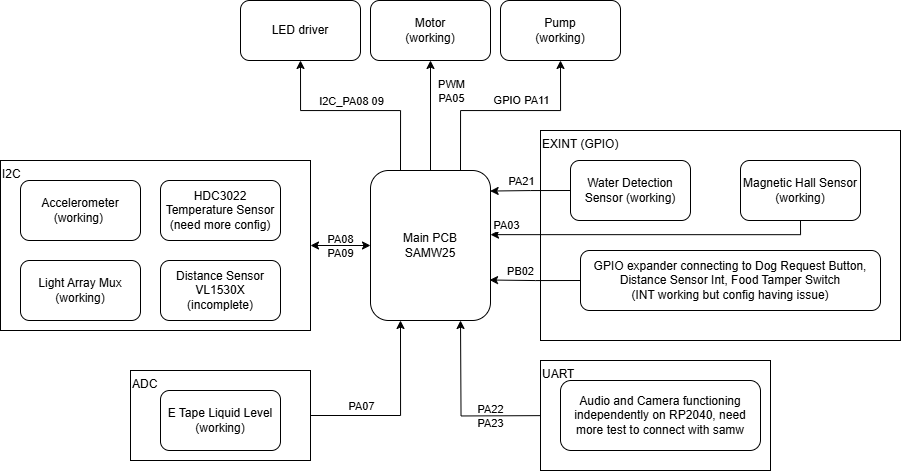

#### C. Challenges

We aimed for a more ambitious projects with plenty sensors and actuators. Thus, in the process, we face a lot of challenges in firmware, hardware, software, integration such as:

**SD Card Issue on PCB:** We encountered a significant problem with the SD card on the PCB, which could impact bootloading. Initially, we suspected it was a firmware configuration issue, such as incorrect pin assignments. However, after testing with the SAMW25 development board and checking signals with an oscilloscope, we discovered that the CLK pin was incorrectly grounded. We attempted to reflow the connections and inspected nearby traces, which allowed some signal to pass, although it was still noisy—likely due to poor soldering beneath the diode. Interestingly, the SD card on our second board works perfectly, reinforcing our suspicion that there was a soldering error on the first board.

**I2C Configuration Delays:** We utilized a total of five I2C components, with two key components functioning correctly. The distance sensor is incomplete, and the temperature sensor and GPIO expander require proper configuration. While we managed to establish successful connections for all components, time constraints prevented us from testing all of them. Therefore, we decided to put the three that do not affect main functionality on hold; they are primarily useful for additional tracking.

**Stack Overflow During Integration:** We faced multiple stack overflow issues during operation due to the large number of components in use. To address this, we increased the maximum heap size to around 1400 and attempted to free up stack space using functions like `vTaskDelete`. Unfortunately, these functions frequently caused crashes in our main flow. As a solution, we opted to combine and optimize our drivers into six major tasks (motor, pump, Wi-Fi, MQTT send, ADC/IMU, CLI) and managed them using semaphores triggered by manual and MQTT commands. All data from the motor, pump, and ADC/IMU will be sent via MQTT by adding it to a queue directed to a small MQTT send task. This approach simplifies management and significantly reduces the stack allocation needed for other tasks.

**LED Driver Issue:** Unfortunately, our PCB for the LED driver was shorted before the demo, forcing us to skip this component.

**Mechanical Prototyping Challenges:** We encountered issues with laser prototyping, which caused the plastic used to construct the dispenser wheel to burn. Additionally, we ran out of time to complete the food storage case. We may need to refine the design further to ensure it fits compactly.

#### D. **Prototype Learnings**

We started quite late with protyping main assemblies as we wanted to wait for the PCB and component and do a dimension sizing first. And in the process, we have some issue with the laser cutting essentially burning the plastic we used, delaying the process greatly.

If we can redo, one thing we would do is to 3D print a smaller version of main assembly way earlier and attempt cutting with laser for example to troubleshoot any issues early.

#### E. Next Steps and Takeaways

Our next steps include:

- Further testings and validations for the remaining components, namely finishing uart connection to the RP2040 and the GPIO expander
- Look into how to integrate more tasks into current firmware
- Finish the mechanical housing with tamper-proof design, water resistance, and pet-safe materials
- Maybe solder our second PCB which has SD card working and better power performance, or attempt to desolder and resolder the first PCB
- Add more interactive UI feature to Node Red

Through ESE5160, I gained a  **comprehensive, hands-on understanding of embedded systems design for IoT devices** . Key takeaways include:

* **Task-Based Real-Time Systems** : I learned how to design, schedule, and debug multithreaded systems using FreeRTOS, including synchronization with semaphores, queues.
* **Sensor Integration and Drivers** : I became proficient in I2C and analog sensor interfacing, multiplexing, and writing reusable, interrupt-driven drivers for real-time data collection.
* **Wireless Communication** : I developed and debugged a complete MQTT-based communication pipeline using the WINC1500 module and Node-RED, including topic planning and message handling.
* **Prototyping and System Debugging** : The iterative hardware-software co-design process taught me how to isolate bugs across multiple layers—from software, firmwawre to hardware—and systematically resolve them.
* **Embedded Cloud Interaction** : I learned to build a real IoT system that not only performs autonomous tasks but also communicates seamlessly with a cloud dashboard for visibility and control.
* **Project Management and Documentation** : Throughout the project, I practiced documenting requirements (HRS/SRS), building reusable modules, and designing clear plan for prototyping.

#### F. **Project Links**

Node-Red URL: http://20.119.83.178:1880/ui/#!/0?socketid=EliXtY1cT05YJYT4AAAy

Altium PCB link: https://upenn-eselabs.365.altium.com/designs/D6B79E83-76DE-4641-93AE-FEBD6BBD5353

## 3. Hardware & Software Requirements

## ✅ Hardware Requirements (HRS)

## ✅ Microcontroller Unit (MCU)

**HRS 01** – The SAMD21 microcontroller shall be the primary processing unit. The Wi-Fi WINC1500 network controller shall be used for IoT connectivity.

✅  *Met* : ATSAMW25 module (SAMD21 + WINC1500) used as main MCU with IoT support.

* **Validation** : Verified on schematic and through successful MQTT communication using Wi-Fi.

**HRS 02** – The SAMD21 and WINC1500 shall be used in the combined ATSAMW25 module

✅  *Met* : Used integrated ATSAMW25 module throughout development.

* **Validation** : Confirmed hardware integration and initialization at boot.

## ✅ Sensors

**HRS 03** – An analog water level sensor shall be used to monitor the height of water in the tank with an accuracy of ±5%.

⚠️  *Partially Met* : Analog water level sensor installed; tested, but not within ±5%.

* **Validation** : Compared against marked cylinder water levels. Observed 10-30% deviation. One issue with the SAMD chip reference ADC voltage not exceeding ~ 2.2V so we cannot detect water level above half the bottle. Solution: we consider the water level "full" above the threshold of the ADC, and low when below ~ 1V after conversion/ the better option would be to add voltage divider to the input on the PCB but that requires more time.
  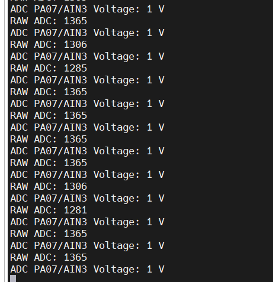
* | Water Level | Corresponding Voltage | ADC value   |
  | ----------- | --------------------- | ----------- |
  | 0%          | 0.0 V                 | 40 - 71     |
  | 20%         | 1.0 V                 | 1281 - 1365 |
  | 40%         | 2.0 V                 | 2051 - 2071 |
  | 50% - 100%  | 2.5 - 5.0 V          | 2256 - 2300 |

**HRS 04** – A float level sensor (digital) shall be used to detect the presence or absence of water in the pet’s drinking bowl.

✅  *Met* : Water level sensor detects presence of water in bowl.

* **Validation** : Bench-tested by filling water to the bowl till water reach the water level sensor tip. Results are consistent interrupt trigger the instance water touched the tip (one issue being the interrupt still triggered if any water not dried out from the sensor tip).

**HRS 05** – A distance sensor shall be used to detect the presence of the pet. The sensor shall measure distance with a range of at least 1 meter and accuracy of ±10%

⚠️  *Partially Met* : Distance sensor detects object within 1m with ±10% accuracy but on the RP2040 (circuitpython), we haven't implemented via the SAM.

* **Validation** : Measured detection accuracy using meter stick; variance < 10%. We are looking to just use this in interrupt mode since continuous polling unnecessary or moving to use it with the RP2040 since it is not key for the PCB.

**HRS 06** – An array of up to 8 light sensors shall be used to monitor food levels at incremental levels. Each sensor shall measure values that can differentiate if food is covering it or not

✅  *Met* : 8 VEML7700 sensors used to determine food coverage.

* **Validation** : Measured raw lux values with and without covering under different light conditions. Consistent detection with lux value 30,000 for no cover, below 10,000 under slight shade, below 1000 under dense shade for normal room lighting. Need additional check with dog food covering but we estimate the threshold to be approximately 1000 for consistent detection. A counter for number of sensor with lux value below threshold utilized to estimate the food percentage remaining as counter/8 * 100%.

  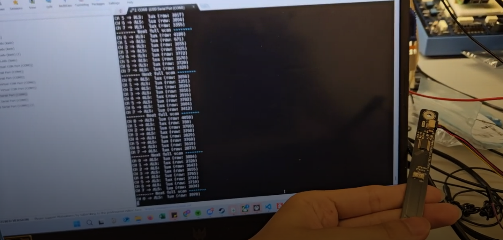

**HRS 07** – An I2C mux/switch shall be used to sample all light sensors output.

✅  *Met* : TCA9548A I2C mux used for sensor array.

* **Validation** : Confirmed via I2C scans and muxed readout of all 8 channels as shown above.

**HRS 08** – An LED driver shall be utilized to operate the LED in the hopper. The LED shall have enough brightness for easy differentiation of light sensor values.

⚠️  Not *Met* : LED driver board burned but the LED working fine with external input.

* **Validation** :

**HRS 09** – An array of reflective sensors shall be used to monitor food levels at incremental levels. Each sensor shall measure values that can differentiate if food is covering it or not.

⚠️  Option skipped : Skipped since the light array above works well and at a much lower cost

* **Validation** :

**HRS 10** – An ADC mux shall be used to sample all reflective sensors output.

⚠️  Option skipped :  I2C mux above working fine

* **Validation** :

**HRS 11** – An LED driver shall be utilized to operate the LEDs in the reflective sensors.

⚠️  Not *Met* : LED driver board burned but the LED working fine with external input.

* **Validation** : Confirmed with multimeter and toggled through test command.

**HRS 12** – An accelerometer shall be used to detect any significant tipping or tilting of the device.

✅  *Met* : IMU detects x, y, z direction acceleratioin with distingushable difference. However, it seems continuous polling of the IMU taking a lot stack space, and it shows weird max reading if allocate too little stack space, so we plan next step to use just the interrupt instead.

* **Validation** : Tested tilting the PCB (980 correspond to earth gravitational acceleration). Inconsistent data likely due to angle placement not that accurate without tool to adjust, but are clearly distingushable in case of tilting or flip over (90+ angle)

| Tilt Angle       | x    | y   | z   |
| ---------------- | ---- | --- | --- |
| 0 (flat surface) | -50  | 21  | 984 |
| 45 along y       | 511  | 36  | 464 |
| 90 along y       | 932  | 201 | 253 |
| 90 forward       | -104 | 840 | 231 |

**HRS 13** – A position switch (magnetic sensor or switch) shall be used to accurately check for one full rotation of the motor.

✅  *Met* : Magnetic switch confirms motor full rotation by triggering interrupt when magnet on dispensing wheel close.

* **Validation** : The sensor triggers when we bring magnet as close as 1 cm near it, and the motor do consistently stops everytime at same location we attach the hall sensor to.

## ✅ Actuators

**HRS 14** – One motor shall be used to perform a rotation of the dispensing mechanism. The motor shall have enough torque to move the mechanism

✅  *Met* : Motor rotates reliably and stops at same position each time. We are planning to add a counter to enable manual input of how many rotations (food) via MQTT command.

* **Validation** : Motor rotates reliably and stops at same position each time. We are planning to add a counter to enable manual input of how many rotations (food) via MQTT command.

**HRS 15** – One Peristaltic Liquid Pump shall be used to pump the water from the tank to the dog food while guaranteeing food safety

✅  *Met* : Water pump fills bowl until float switch triggered. GPIO used instead of PWM for higher pump power and less interference as wifi task also use same TCC with my pump pin

* **Validation** : Confirmed pump stops everytime water detection sensor triggers (water level reached). No overflow observed.

**HRS 16** –One motor driver shall be used to control the direction and torque for the motor and pump

 ✅  *Met* : Motor driver (H-bridge) used for both motor and pump.

* **Validation** : Controlled via PWM and direction pins. Verified direction toggling.

**HRS 17** – Status LEDs shall be used to turn on/off showing different device status.

⚠️  Option skipped :  Ran out of pins and not very necessary

* **Validation** :

## ✅ Power

**HRS 18** –The system shall draw power from one LiPo battery with power regulation for the MCU, power rail for motor/pump, and option to use USB-PD to power. One simple switch shall be used to turn on the system.

✅  *Met* : Powered via LiPo battery with 3.3V regulation; USB-type C capable of supplying power on second board only. The 12V power adapter successfully supplying the motor and pump rail. All power checked. Switch skipped

* **Validation** : Power supplies and voltages tested under load. One issue with the BQ showing weird behaviour when input current exceed 500 mA, so need to use battery along with power adapter.

## ✅ Additional Features

**HRS 19** – A dog request button shall be used for the dog (trained) to press on to request food. The button shall have a diameter of 100mm to make it easy to press

⚠️  Not *Met* : Not set up yet due to time issue but it should be exactly the same with other GPIO interrupts implemented

* **Validation** :

**HRS 20** – A camera module shall take a picture of the dog. Another MCU shall be needed to control.

⚠️  Partially *Met* : RP2040 captures png image locally at the moment but we haven't set up UART to command/stream the image to platform

* **Validation** : Image saved/uploaded locally.

**HRS 21** – An audio module including MCU, amplifier, speaker shall be used to play the recorded audio such as calling the dog.

✅  *Met* : Audio plays pre recorded message through speaker upon command but we haven't set up UART to command

* **Validation** : Audio files played correctly.

**HRS 22** – A limit switch shall be used to check if the cover of the hopper/tank is set or not.

⚠️  *Not Met* : Limit switch connected to GPIO expander but configuration not finished.

* **Validation** :

## ✅ Software Requirements (SRS)

**SRS-01** – **Device Initialization**

✅  *Met* : All components initialize on power; PCB connects to wifi and MQTT server within 20s.

**SRS-02** – **Dog Presence Detection**

⚠️  Partially *Met* : Distance sensor detects dog within 100cm but from the RP2040, not main PCB. Logging not utilized

**SRS-03** – **Food Level Monitoring**

✅  *Met* : Food level estimated via sensors from 12.5%, 25%, to 100% (8 sensors). Result updated to a queue and sent to the Node-Red to be displayed. Alert when below 20% not adapted but we expect to write function for that on Node Red to reduce stack cost.

**SRS-04** – **Water Level Monitoring**

✅  *Met* : Bowl and tank levels read and updated to queue to send to platform. Scheduling not implemented. Alert when below 20% not adapted but we expect to write function for that on Node Red to reduce stack cost.

**SRS-05** – **Tilt Detection & Device Stability**

✅  *Met* : IMU currently set to continuous polling. Data logged as a buffer and sent via MQTT to log on platform.

**SRS-06** – **Battery & Power Management?**

⚠️  Option skipped : Since we use power adapter plugged to power source directly, no need to track

**SRS-07** – **Food Dispensing**

✅  *Met* : Motor rotates when command received from platform and stops at the magnetic switch position (exactly one rotation). Event logged to MQTT. No scheduling and cool down yet.

**SRS-08** – **Water Dispensing**

✅  *Met* : Pump runs (via MQTT command) until water detection sensor signals full, ensuring no overflow. Next step is to automatically refill if water not detected.

**SRS-09** – **Scheduled Feeding & Water Dispensing**

⚠️  *Not Met* :Not implemented yet.

**SRS-10** – **Audio Alerts & Custom Pet Calls**

⚠️  Partially *Met* : Audio clips can play but right now just from manual command. Need UART connection to main PCB to drive with MQTT command.

**SRS-11** –  **Dog Request Button for Communication**

⚠️  *Not Met* :Not implemented yet.

**SRS-12** – **Camera Monitoring & Pet Image Capture**

⚠️  Partially *Met* :Camera captures image when dog is nearby just from manual command. Need UART connection to main PCB to drive with MQTT command.

**SRS-13** – **IoT Connectivity**

✅  *Met* : Wi-Fi connection established via http and MQTT. Re-establish working

**SRS-14** – **Real-Time Remote Control via IoT Platform**

✅  *Met* : All commands received in real-time. Verified latency <5s.

**SRS-15** – **Data Logging & Storage**

✅  *Met* : Water, food, and tilt vents logged. Retains time past 1 week.

**SRS-16** – **Security & Data Encryption**

⚠️  *Partially Met* : Authentication placeholder exists; default security right now.

**SRS-17** – **Notifications & Alerts**

⚠️  *Not Met* :Not implemented yet.

## ✅ Requirements Validation Summary

### 🔧 Hardware Requirements (HRS)

| ID              | Requirement Summary                                     | Status             |
| --------------- | ------------------------------------------------------- | ------------------ |
| HRS 01          | SAMD21 used as main MCU with WINC1500 for IoT           | ✅ Met             |
| HRS 02          | ATSAMW25 module used                                    | ✅ Met             |
| HRS 03          | Analog water level sensor, ±5% accuracy                | ⚠️ Partially Met |
| HRS 04          | Float sensor detects water presence in bowl             | ✅ Met             |
| HRS 05          | Distance sensor detects pet presence at 1m ±10%        | ⚠️ Partially Met |
| HRS 06          | 8 light sensors for food detection                      | ✅ Met             |
| HRS 07          | I2C mux used for sensor sampling                        | ✅ Met             |
| HRS 08          | LED driver for hopper lighting                          | ⚠️ Not Met       |
| HRS 09          | Reflective sensor array for food detection              | ⚠️ Skipped       |
| HRS 10          | ADC mux for reflective sensors                          | ⚠️ Skipped       |
| HRS 11          | LED driver for reflective sensor lighting               | ⚠️ Not Met       |
| HRS 12          | Accelerometer detects tilt                              | ✅ Met             |
| HRS 13          | Magnetic switch for motor rotation feedback             | ✅ Met             |
| HRS 14          | Motor rotates for food dispense                         | ✅ Met             |
| HRS 15          | Water pump to refill bowl                               | ✅ Met             |
| HRS 16          | Motor driver for motor and pump                         | ✅ Met             |
| HRS 17          | Status LEDs for system indication                       | ⚠️ Skipped       |
| HRS 18          | Powered by LiPo battery and/or USB-PD                   | ✅ Met             |
| HRS 19          | Dog request button                                      | ⚠️ Not Met       |
| HRS 20          | RP2040 camera takes dog photo                           | ⚠️ Partially Met |
| HRS 21          | Audio module for pet interaction                        | ✅ Met             |
| HRS 22          | Limit switch on hopper lid                              | ⚠️ Not Met       |
| **Total** | **14 Met, 3 Partially Met, 4 Not Met, 3 Skipped** | **14/22**    |

---

### 💻 Software Requirements (SRS)

| ID              | Requirement Summary                                    | Status             |
| --------------- | ------------------------------------------------------ | ------------------ |
| SRS-01          | Device initializes and connects to cloud               | ✅ Met             |
| SRS-02          | Distance sensor detects dog within 20 cm               | ⚠️ Partially Met |
| SRS-03          | Food level reported and alerts at <20%                 | ✅ Met             |
| SRS-04          | Water level monitoring and alerts                      | ✅ Met             |
| SRS-05          | Tilt detection and alert                               | ✅ Met             |
| SRS-06          | Battery status updates                                 | ⚠️ Skipped       |
| SRS-07          | Food dispensing with cooldown and rotation limit       | ✅ Met             |
| SRS-08          | Water dispensing with float switch                     | ✅ Met             |
| SRS-09          | Scheduled feeding and watering                         | ⚠️ Not Met       |
| SRS-10          | Audio playback on event                                | ⚠️ Partially Met |
| SRS-11          | Dog request button alerts                              | ⚠️ Not Met       |
| SRS-12          | Camera image capture when dog nearby                   | ⚠️ Partially Met |
| SRS-13          | Wi-Fi and MQTT connectivity                            | ✅ Met             |
| SRS-14          | Real-time MQTT control via Node-Red                    | ✅ Met             |
| SRS-15          | Event logging and 7-day storage                        | ✅ Met             |
| SRS-16          | Secure authentication and encrypted data               | ⚠️ Partially Met |
| SRS-17          | Notifications and alerts sent to platform              | ⚠️ Not Met       |
| **Total** | **9 Met, 4 Partially Met, 3 Not Met, 1 Skipped** | **9/17**     |

## 4. Project Photos & Screenshots

##### The standalone PCBA, top

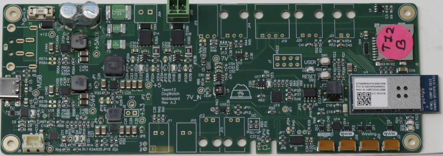

##### * Before soldering

- **Soldered**

##### The standalone PCBA, bottom

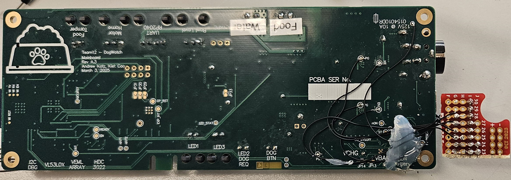

##### Thermal camera images while the board is running under load

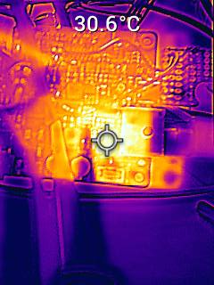

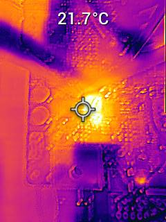

##### The Altium Board design in 2D view (screenshot)

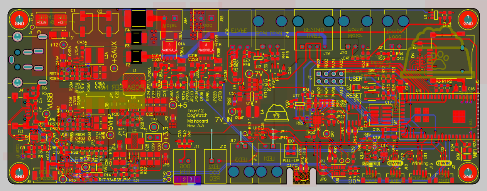

**The Altium Board design in 3D view (screenshot)**

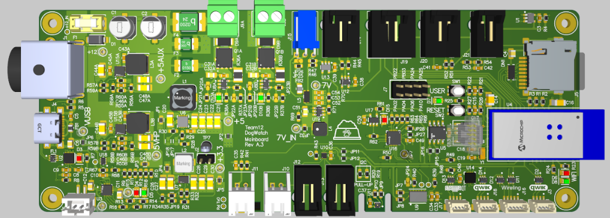

##### Node-RED dashboard (screenshot)

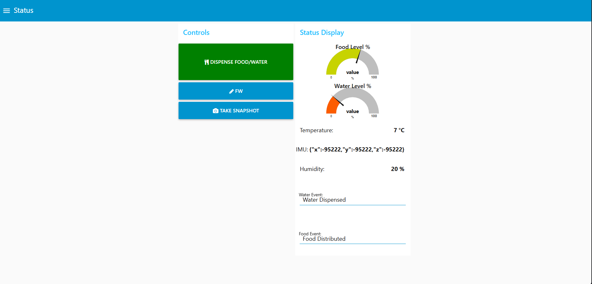

##### Node-RED backend (screenshot)

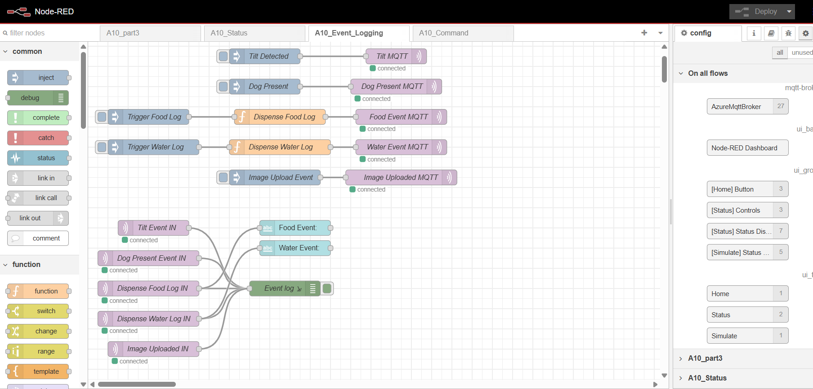

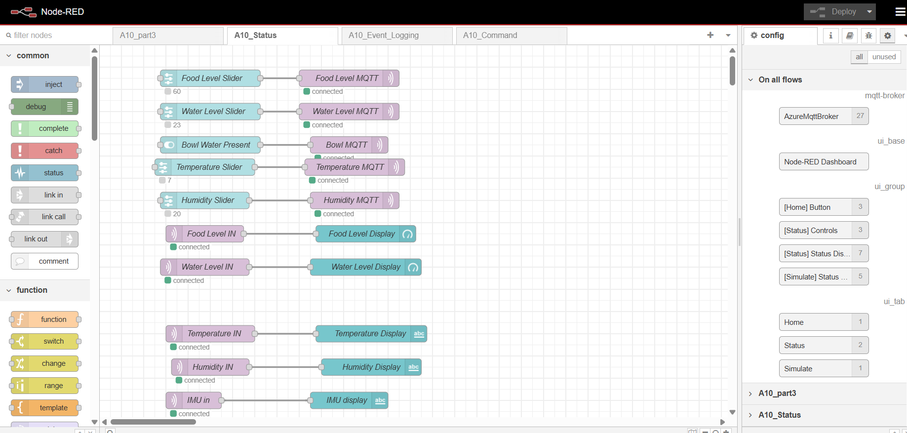

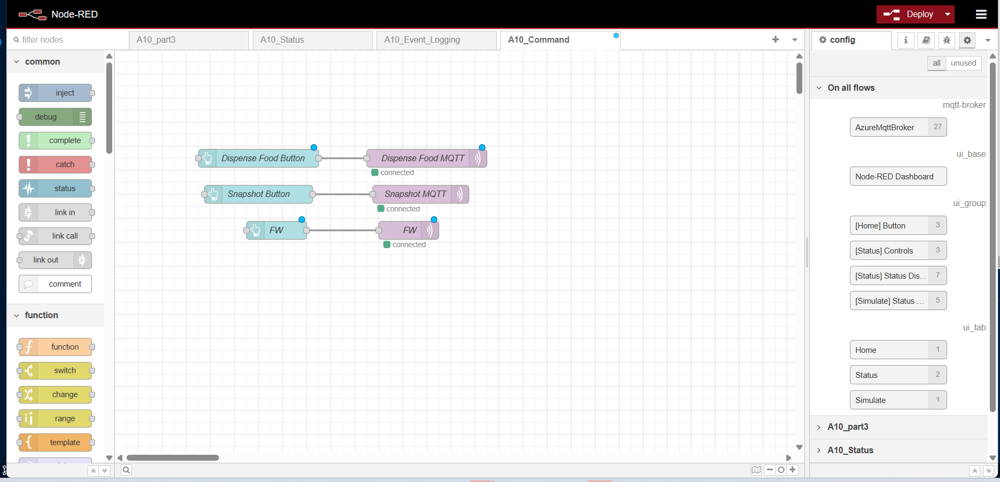

##### Block diagram of your system

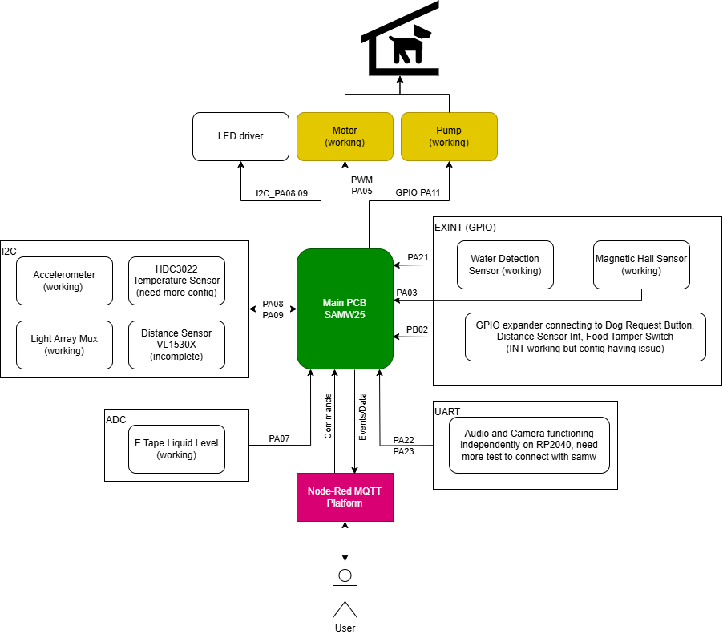

**

**Extra PCB (Light Sensor Array):**

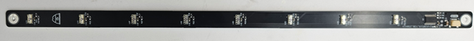

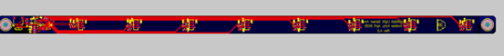

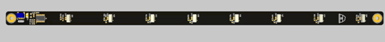

## Codebase

- A link to your final embedded C firmware codebases (Recognigtion: AI used to make multiple comments into cleaner Doxygen style)

  https://github.com/ese5160/final-project-t12-andrew-and-kiet/tree/main/Bootloader
- A link to your Node-RED dashboard code

  https://github.com/ese5160/final-project-t12-andrew-and-kiet/tree/main/Node-Red
- Links to any other software required for the functionality of your device

  https://github.com/ese5160/final-project-t12-andrew-and-kiet/tree/main/avboard
